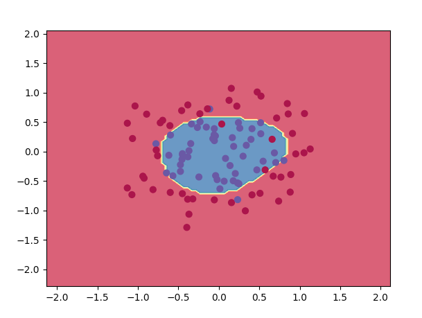
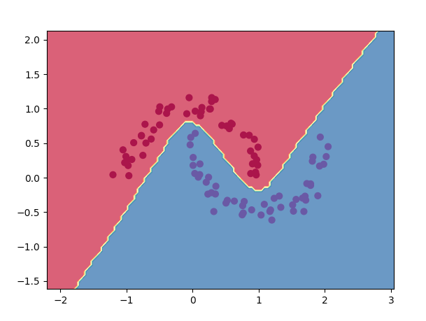

# brain

This project is an implementation of artifical neural networks and the [backpropagation](https://en.wikipedia.org/wiki/Backpropagation) algorithm from scratch.

### Example

```python
from neuralnetwork import Brain

# Network with 3 inputs, two hidden layers with 6 and 4 neurons respecively and 2 output neurons. With hyperbolic tangent as activation function.
brain = Brain([3, 6, 4, 2], "Hyp tan")

# xs <- input data
# ys <- corresponding output data

xs = [
    [2.0, 3.0, -1.0],
    [2.0, -1.0, 0.5],
    [0.5, 1.0, 1.0],
    [1.0, 1.0, -1.0],
    [2.0, 2.0, 0.7]
]

ys = [[1, 0], [0, 1], [0, 1], [1, 0], [1, 0]]

# Learn for 2000 epochs with a learn rate of 0.01
brain.learn(2000, 0.01, xs, ys)
```

### Training larger networks
In [circle.py](https://github.com/moscars/brain/blob/main/examples/circle.py) and [halfmoons.py](https://github.com/moscars/brain/blob/main/examples/halfmoons.py) the network is trained to classify points in 2d space with the following decision boundaries:





The nextwork can also learn to classify handwritten digits. In [handwrittendigits.py](https://github.com/moscars/brain/blob/main/examples/handwrittendigits.py) this is done on the MNIST dataset with approximately 90% accuracy on unseen data.